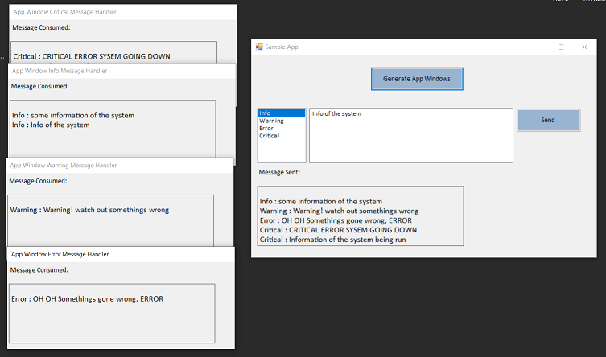

# Mediator (Behavioural Pattern)

## Overview

## Intent

## UML Diagram

## Code Example

## Example Output

## Mapping the UML classes to Example code
| **File/Class Name** | **Mapping Class in UML**  |
| :-----: | :-: |
|[Library.MessageRouter/IMessageConsumer.cs](./Library.MessageRouter/IMessageConsumer.cs)|*Coleague Interface*|
|[Library.MessageRouter/IMessageMediator.cs](./Library.MessageRouter/IMessageMediator.cs)|*Mediator Interface*|
|[Library.MessageRouter/IMessageConsumer.cs](./Library.MessageRouter/MsgMediator.cs)|*Concrete Mediator*|
|[App.Main/AppWindow.cs](./App.Main/AppWindow.cs)|*Concrete Coleague1*|
|[App.Main/MainApp.cs](./App.Main/MainApp.cs)|*Concrete Coleague2*|

## Points to Remember

## Resources
- https://www.dofactory.com/net/mediator-design-pattern