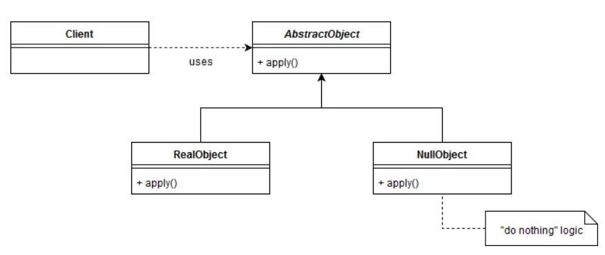
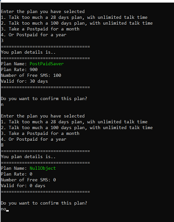

# (Behavioural Pattern)

## Overview
In cases where we crate a 'kind' of object baed on a condition or crate from a factory, there is always possibility of no object being created and thus the factory retuning a null. This means, you have many checks for null throughout the code.
Instead of checking for the null object everywhere, we can define null behavior or call do-nothing behavior.

## Intent

## UML Diagram

## Code Example

## Example Output

## Mapping the UML classes to Example code
| **File/Class Name** | **Mapping Class in UML**  |
| :-----: | :-: |
|[Base.Enumerable/IEnumerableData.cs/Iterator Interface](./Base.Enumarable/IEnumarableData.cs)|*Iterator*|

## Points to Remember

## Resources