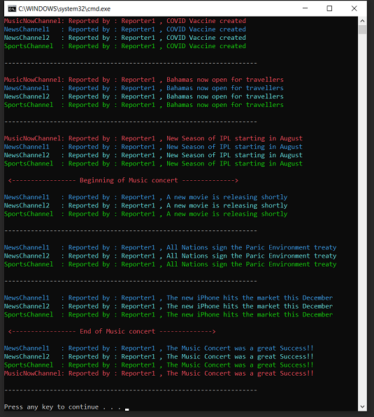

# Observer (Behavioural Pattern)

## Overview
Observer is a behavioral design pattern that lets you define a subscription mechanism to notify multiple objects about any events that happen to the subject that is being observed.

## Intent
- Define a one-to-many dependency between objects so that when one object changes state, all its dependents are notified and updated automatically.
- Encapsulate the core (or common or engine) components in a Subject abstraction, and the variable (or optional or user interface) components in an Observer hierarchy.

## UML Diagram

## Code Example

## Example Output

## Mapping the UML classes to Example code
| **File/Class Name** | **Mapping Class in UML**  |
| :-----: | :-: |
|[Base.Enumerable/IEnumerableData.cs/Iterator Interface](./Base.Enumarable/IEnumarableData.cs)|*Iterator*|

## Points to Remember
- The "View" part of Model-View-Controller is an observer, Model being the subject. The controller based on its functionalty could encapsulate a Modeator pattern using a observer pattern.
- Some points to define the characterisitcs of obeserver pattern
-- The client configures the number and type of Observers.
-- Observers register themselves with the Subject.
-- The Subject broadcasts events to all registered Observers.
-- The Subject may "push" information at the Observers, or, the Observers may "pull" the information they need from the Subject.

## Resources
- https://www.baeldung.com/java-observer-pattern
