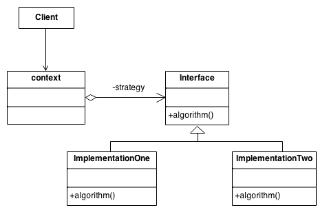

# Strategy (Behavioural Pattern)

## Overview
Strategy is a behavioral design pattern that lets you define a family of algorithms, put each of them into a separate class, and make their objects interchangeable.

## Intent

- Define a family of algorithms, encapsulate each one, and make them interchangeable. Strategy lets the algorithm vary independently from the clients that use it.
- Capture the abstraction in an interface, bury implementation details in derived classes.

## UML Diagram

## Code Example

## Example Output

## Mapping the UML classes to Example code
| **File/Class Name** | **Mapping Class in UML**  |
| :-----: | :-: |
|[Base.Enumerable/IEnumerableData.cs/Iterator Interface](./Base.Enumarable/IEnumarableData.cs)|*Iterator*|

## Points to Remember

- Strategy is like Template Method except in its granularity.
- State is like Strategy except in its intent.
- Strategy lets you change the guts of an object. Decorator lets you change the skin.
- State, Strategy, Bridge (and to some degree Adapter) have similar solution structures. They all share elements of the 'handle/body' idiom. They differ in intent - that is, they solve different problems.
- Strategy has 2 different implementations, the first is similar to State. The difference is in binding times (Strategy is a bind-once pattern, whereas State is more dynamic).
- Strategy objects often make good Flyweights.

## Resources
https://softwarebydefault.com/2013/03/03/colomatrix-image-filters/
